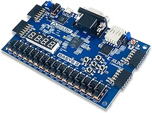

# E-Commerce X Company

Build a **e-commerce** to *X company* . . . than then some

## Funcionalities

_Checkout, **Product screen**, Catalog, Banner Home_


###### Improvement in Project

__Improve 1__, _improve 2..._


### Project Languages:
* HTML
* CSS
* JavaScript
* PHP
* MySQL

### Functionalities to Develop
1. Members
	1. login
2. Payments
	1. Credit card
	2. Pix
3. 1st purchase bonus

#### Local Image 



#### Exteral Image


## Interessants links:

[Google](https://www.google.com)

[https://www.horadecodar.com.br](https://www.horadecodar.com.br)

Profile: https://github.com/BedinEduardo
[](https://github.com/BedinEduardo)

## Sun function code

```Javascript
function soma(a,b) {
	return a + b;
}

``` 

## Task list 
- [x] Member area
- [ ] Payment integration
- [ ] Bonus system
- [x] footnote CSS
